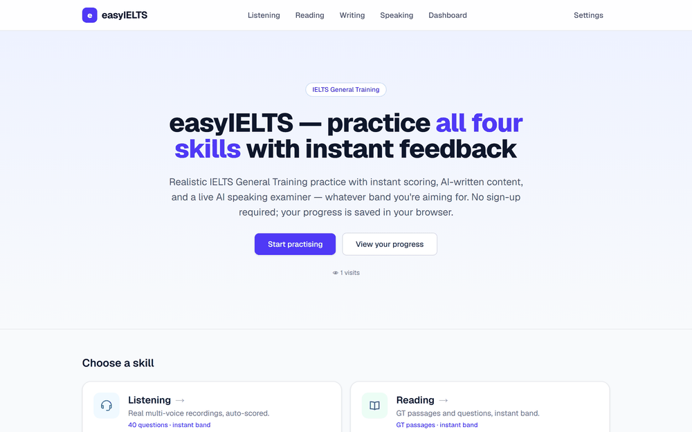

# easyIELTS

[简体中文](README.md) · [English](README.en.md)

一个用于 **雅思 General Training（培训类）** 备考的 Web 应用，覆盖听、读、写、说四项技能。



- **听力 & 阅读** —— 自动评分的模拟测试，并换算为雅思分数段（band）。
- **写作** —— 由大语言模型（LLM）评分（4 项评分标准 + 反馈 + 范文）。
- **口语** —— 通过 **Gemini Live API** 进行实时口语模拟考试，随后由 LLM 评分。
- **使用你自己的 AI** —— 任何用户都可以连接自己的 **GitHub Copilot** 账号来使用高级模型
  （Claude Opus、GPT-5.x 等），也可以填入自己的 **Gemini** 密钥。你选择的模型会用于 LLM 评分
  **以及** AI 生成测试/题目，并覆盖 **全部** 模块（听力、阅读、写作、口语）—— 无需在本应用中登录。
- 无需登录：学习进度保存在浏览器的 **localStorage** 中。站点所有者配置的 API 密钥仅在服务端使用，
  绝不会发送到浏览器。

基于 Next.js 16（App Router）+ React 19 + TypeScript + Tailwind v4 构建，运行在一个自定义的
Node 服务器（`server.ts`）之上，该服务器同时桥接口语功能所需的 WebSocket 代理。

## 快速开始（一条命令）

启动脚本会自动检查 Node.js（如果缺失或版本过低会自动安装），安装依赖、构建并启动网站：

**Windows（PowerShell）：**

```powershell
.\start.ps1          # 生产模式构建并启动
.\start.ps1 -Dev     # 开发服务器（热重载）
```

> 如果 PowerShell 阻止脚本运行，可在当前会话中临时放开权限：
> `Set-ExecutionPolicy -Scope Process -ExecutionPolicy Bypass`

**Linux / macOS：**

```bash
./start.sh           # 生产模式构建并启动
./start.sh --dev     # 开发服务器（热重载）
```

在 Windows 上脚本通过 **winget** 安装 Node.js；在 Linux/macOS 上通过 **nvm** 安装。如果无法
自动安装，脚本会给出 <https://nodejs.org/> 链接提示你手动安装。随后在浏览器打开脚本输出的地址
（默认 **http://localhost:3000**）。

**一步开启公网 HTTPS（Linux）：** 在 `.env` 中设置 `EASYIELTS_DOMAIN=your.domain.com`，然后运行
`./start.sh` 时会一并配置 HTTPS 反向代理（Caddy，端口 8443）并让应用运行在其后 —— 这是口语麦克风
所必需的。仅在首次签发或续期证书时需要短暂占用 80 端口（并使用 `sudo`）；详见
[HTTPS](#https麦克风必需)。

如果想手动操作，请参考下文的 [环境要求](#环境要求) 与 [运行](#运行)。

## 环境要求

- Node.js 20+（在 24 上测试通过）
- `npm install`

## 配置

将 `.env.example` 复制为 `.env`（或 `.env.local`），按需填写。**所有密钥都是可选的** —— 未设置的
密钥只会禁用对应的共享/所有者通道；用户可以在应用内 **/settings** 页面填入自己的密钥。

```bash
# 仅服务端使用的所有者密钥（绝不会暴露给浏览器）
GITHUB_MODELS_TOKEN=          # 具有 Models 访问权限的 GitHub token（共享回退通道）
GEMINI_API_KEY=               # 所有者的 Gemini 密钥（共享的口语代理）

# 可选项覆盖（未设置时使用安全默认值）
GEMINI_LIVE_MODEL=gemini-3.1-flash-live-preview

# 服务器
PORT=3000
HOST=localhost
```

> 仅在开发模式下，如果 `GITHUB_MODELS_TOKEN` 为空，服务器会回退到 `gh auth token`
> （这样本地已登录的 GitHub CLI 即可零配置使用）。

## 运行

**开发模式**（自动重载）：

```bash
npm run dev
```

**生产模式**：

```bash
npm run build
npm start
```

随后打开 **http://localhost:3000**（或你设置的 `PORT`）。可用 `PORT` / `HOST` 修改地址，
例如 `PORT=8080 npm run dev`。

> 请使用上述 npm 脚本，而不要直接运行 `next dev` / `next start`。应用通过自定义的 `server.ts`
> （借助 `tsx`）运行，它会加载 `.env` 并挂载口语代理。

## 使用你自己的 GitHub Copilot 模型

连接你的 GitHub Copilot 账号后，便可在 **整个** 应用中使用高级模型，而不仅限于某一项技能：

1. 进入 **/settings → “Connect with device code”（用设备码连接）**，并在浏览器中完成授权。
2. 页面会出现一个 **模型（model）** 下拉框，列出你的 Copilot 模型。
3. 选择其中一个（如 `claude-opus-4.8`、`gpt-5.5`）。你的选择随后会用于 **所有需要 LLM 的地方** ——
   写作与口语评分，以及生成新的听力 / 阅读 / 写作 / 口语测试和题目。

连接之后，请求会运行在你自己的（无限额度）Copilot 账号上，而不是受限速的共享通道。
你的 GitHub token 会保存在 httpOnly cookie 中，并在 **服务端** 换取 Copilot token ——
它绝不会暴露给浏览器。

## 管理员页面（面向所有用户的共享凭据）

在 `.env` 中设置 **`ADMIN_PASSWORD`** 即可启用 **`/admin`**。登录后，你可以设置对 **所有** 访客
生效的凭据（用户自己的密钥/连接始终优先，这些只是回退）：

- **连接共享的 GitHub Copilot 账号**（设备码）—— 连接后，所有人都能用它进行 LLM 评分和测试/题目
  生成，无需各自连接；还可以 **选择该共享账号使用的模型**；点击“断开”即可立即移除。
- **设置 / 取消共享的 Gemini 密钥** —— 用于尚未填写自己 Gemini 密钥的用户的实时口语、口语评分和
  听力音频。

更改会写入 `.env`（因此重启后仍然有效）并实时生效，无需重启。管理员页面绝不会把明文密钥返回给
浏览器（仅返回状态和打码提示）。设置页中按用户的 **“用设备码连接”** 保持不变，仅对该浏览器生效。
若未设置 `ADMIN_PASSWORD`，则 `/admin` 处于禁用状态。

## 往年真题（你的私有题库）

运行 **你自己提供的整套真题**。文件保留在你本机 —— 将每套测试放进被 gitignore 的
**`private/past-exams/`** 文件夹（每套一个子目录，含 `manifest.json` 与音频文件），然后打开
**`/past-exams`**。听力/阅读自动评分；写作/口语使用 LLM/实时考官。`private/` 中的内容绝不会被提交
或上传。格式与模板见 [`examples/past-exams/`](examples/past-exams/)，且请仅添加你有合法权利使用的
材料。可用 `EASYIELTS_PAST_EXAMS_DIR` 覆盖该文件夹路径。（该页面可通过 URL 访问，但不显示在导航栏。）

## 书籍（你的私有 PDF 库）

在 **`/books`** 中阅读 PDF 学习书籍。把你自己的 `.pdf` 文件放进被 gitignore 的
**`private/books/`** 文件夹即会出现在列表中，点击即可在内嵌阅读器中查看。`private/` 中的内容绝不会
被提交或上传 —— 请仅添加你有合法权利使用的材料。可用 `EASYIELTS_BOOKS_DIR` 覆盖该文件夹路径。
详见 [`examples/books/`](examples/books/)。

## 路由

| 路径 | 说明 |
|------|-------------|
| `/` | 首页 |
| `/listening`、`/reading` | 自动评分的模拟测试 |
| `/reading/generate` | AI 生成的原创阅读测试 |
| `/writing` | 由 LLM 评分的写作任务 |
| `/speaking` | Gemini 实时口语考试 |
| `/books` | 你的私有 PDF 书籍库 |
| `/past-exams` | 你的私有往年真题库（四项技能；不在导航栏） |
| `/dashboard` | 你的答题记录与分数段进度 |
| `/settings` | 你的 API 密钥与模型选择 |
| `/connect` | 连接 GitHub（设备码流程） |
| `/admin` | 站长：共享 Gemini 密钥 + 共享 Copilot（需 `ADMIN_PASSWORD`） |

## 测试、检查、构建

```bash
npm run test     # vitest（单元 + 组件测试）
npm run lint     # eslint
npm run build    # 生产构建
```

## 部署（免费托管）

easyIELTS 需要一个 **真正的 Node 进程** —— 它的 API 路由会持有仅服务端可见的密钥，并且运行着
用于实时口语的 WebSocket 代理 —— 因此 **像 GitHub Pages 这样的静态托管无法运行它**。请选择一个
能运行常驻 Node 服务并支持 WebSocket 的托管平台。

**Render（免费、最简单）** —— 本仓库自带 [`render.yaml`](render.yaml) Blueprint：

1. 将仓库推送到 GitHub。
2. 在 Render 中：**New → Blueprint**，选择该仓库并应用。
3. （可选）在控制台中设置 `GITHUB_MODELS_TOKEN` / `GEMINI_API_KEY`；也可以不设置，让用户在
   **/settings** 页面填入自己的密钥。

> Render 免费服务在空闲约 15 分钟后会休眠，因此休眠后的第一次请求会比较慢。

**Fly.io / Koyeb / Railway / 任意 Docker 主机** —— 本仓库自带 [`Dockerfile`](Dockerfile)：

```bash
fly launch        # 会自动识别 Dockerfile；用 fly secrets set KEY=value 设置密钥
```

**务必设置 `HOST=0.0.0.0`**（`render.yaml` 与 `Dockerfile` 已经设置好了），这样服务才可被访问；
并以环境变量的形式提供密钥 —— 切勿提交到代码库。

**Vercel** 原生支持 Next.js，但它是无服务器（serverless）架构，因此依赖自定义服务器的
**实时口语** 代理无法在其上运行；其余功能均可正常工作。

## HTTPS（麦克风必需）

浏览器只允许在 **安全上下文**（HTTPS 或 `localhost`）下访问麦克风（`getUserMedia`，**口语** 模块
要用到）。公网上的 **HTTP** 站点会被浏览器 **禁用麦克风**，因此必须使用 HTTPS 提供服务。

**推荐：交给 `start.sh` 自动完成。** 在 `.env` 中设置你的域名：

```bash
EASYIELTS_DOMAIN=your.domain.com     # 该域名的 DNS 需指向本机
```

然后运行 `./start.sh`。它会把应用私有地运行在 `127.0.0.1:3000`，并在其前面架设一个
**Caddy HTTPS 反向代理（端口 `:8443`）**（真实的 Let's Encrypt 证书，并代理口语所需的
WebSocket），同时在本机防火墙放行 `:8443`。随后访问 **https://your.domain.com:8443** —— 麦克风即可使用。

> 使用 `:8443` 端口，因此不会与 80/443 上的任何服务冲突。仅在需要签发或续期证书时（首次，之后约每
> 60 天一次）才会短暂占用 80 端口 —— 届时脚本会提示你停止占用 80 的服务，完成后再启动回来。你仍需
> 在 **云安全组** 中手动放行 `:8443`（VM 无法代你完成）。可用 `EASYIELTS_HTTPS_PORT` 修改端口。

**托管平台**（Render、Fly.io 等）本身已提供 HTTPS，麦克风开箱即用。

### 其它部署情况

根据 80/443 端口上已有的服务，你也可以采用下列方式（均可让应用运行在 `HOST=127.0.0.1` 之后）：

- **80/443 空闲** → 用独立 Caddy 获得不带端口后缀的 `https://your.domain.com`：
  `sudo EASYIELTS_DOMAIN=your.domain.com bash deploy/setup-https.sh`
  （参见 [`deploy/Caddyfile`](deploy/Caddyfile)）。
- **已有 Web 服务器占用 80/443**（Nginx/Apache/Caddy）→ 新增一个虚拟主机，把 `your.domain.com`
  反向代理到 `127.0.0.1:3000`（已启用 WebSocket）：[`deploy/nginx-easyielts.conf`](deploy/nginx-easyielts.conf)、
  [`deploy/apache-easyielts.conf`](deploy/apache-easyielts.conf)，或把
  [`deploy/Caddyfile`](deploy/Caddyfile) 的站点块加入现有 Caddy。
- **非 Web 服务占用 80/443，且连 80 端口都无法释放** → 改用非标准端口 + **DNS-01** 证书：
  参见 [`deploy/Caddyfile.altport`](deploy/Caddyfile.altport)（需要 DNS 提供商的 API token）。

> 本地无 TLS 的临时测试：Chrome 的 `chrome://flags/#unsafely-treat-insecure-origin-as-secure`
> 可以把某个 `http://host:3000` 源加入白名单 —— 仅供你自己测试，不适用于面向用户。


